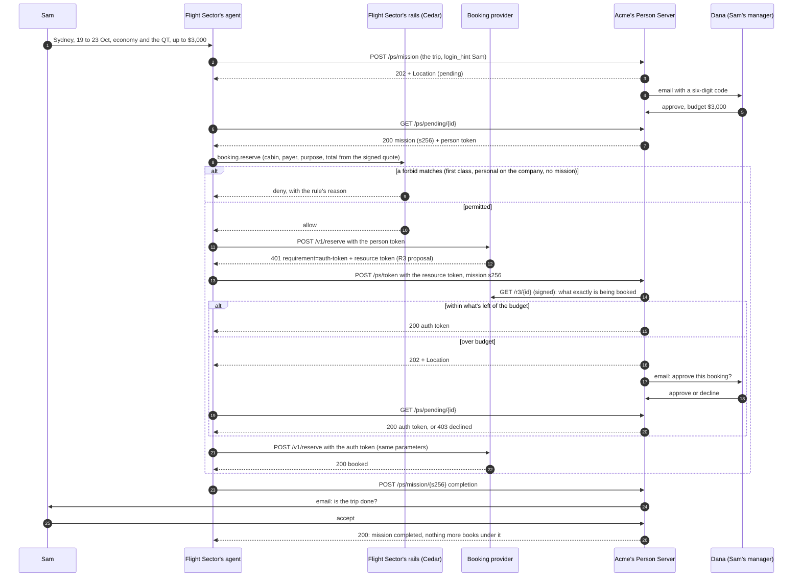

# Flight Sector: an AAuth travel demo

Flight Sector books work travel for other companies' employees. An employee messages Flight Sector's travel agent, and the agent proposes the trip to **that employee's company**. The traveller's manager approves the trip once, with its budget; bookings within it then need no one, and one over what is left goes back to the manager. Once they decide, the conversation picks up by itself.

None of this is decided by the model, and the agent never holds a credential. It runs on [AAuth](https://github.com/dickhardt/AAuth) at -11, three-party, with a mission:

- the **Agent Provider** (the platform's control plane) mints an agent token for each session, binding the session's Ed25519 key;
- the platform's **egress** signs each of the agent's requests (RFC 9421) and presents the best token it holds;
- the traveller's **Person Server** (Acme's) approves the trip as a **mission** and issues person tokens under it;
- the **resource** (Flight Sector's booking provider) answers `401` with a resource token naming one booking's R3 proposal;
- egress takes the resource token to Acme, which answers `200` with an auth token within the trip's budget, `202` while it asks the manager, or `403`.

This example is the **Flight Sector side and the Acme side** of the demo, and the explainer. The platform side (Agent Provider, egress signing, missions, waiting on a `202`) lives in `introspection-cloud`; see `docs/design/connectors-aauth-b2b2c.md` §12.

- **Booking provider** (`https://booking.flightsector.localhost`) is a native three-party AAuth resource on [`@aauth/resource`](https://www.npmjs.com/package/@aauth/resource). Search is open and every offer carries a quote it signs. A reservation presenting an agent token gets `401 requirement=person-token`; one presenting a person token gets `401 requirement=auth-token` and a resource token for an R3 proposal only the person's Person Server can read; one presenting an auth token for that proposal is booked.
- **Acme's Person Server** (`https://ps.acme.localhost`) is Acme's system, not Flight Sector's. It has a mission endpoint, a person-token endpoint and a token endpoint. A trip's manager approves it by a six-digit emailed code (approval page at `/approve/{id}`); within the trip, Acme issues auth tokens until the budget runs out, and asks the manager again past it. It books nothing outside a mission.
- **The walkthrough** (`https://flightsector.localhost`) covers every step of the flow, beside the code behind it. Steps light up as these services see traffic. `WALKTHROUGH.md` is the same thing as a document.

The agent itself is the public [travel-agent recipe](https://github.com/introspection-org/recipe-travel-agent). The walkthrough shows it from a vendored snapshot in `recipe/`.

## The flow

Sam's trip is "Flights and a hotel for Sam, 19 to 23 October, up to $3,000."

| Sam asks for                      | What happens                                                                                    |
| --------------------------------- | ----------------------------------------------------------------------------------------------- |
| The trip                          | `202`: Acme emails Dana, Sam's manager, a code. Dana approves the mission on Acme's page        |
| QF74 economy, SFO to SYD ($1,650) | `200`: within the trip's budget, so Acme issues an auth token and it's booked with no one asked |
| QT Sydney, 4 nights ($1,680)      | `202`: $1,350 is left, so Acme asks Dana again. Dana approves, and it's booked                  |
| A booking with no trip            | `403` from Acme, and from the recipe's `missionless-booking` rule before that                   |
| "That's everything"               | the agent proposes the mission complete; Sam accepts, and nothing more books under it           |

One booking, end to end. Every arrow from the agent is an HTTP request signed with the agent's key (RFC 9421); in the platform the egress signs it, and on the demo page the page's agent does.



| Token          | What it says                                                                |
| -------------- | --------------------------------------------------------------------------- |
| agent token    | who the agent is: the Agent Provider binds the session's key                |
| mission        | the trip the manager approved, and its budget, by hash (`mission_s256`)     |
| person token   | the person the agent acts for, at one resource, under the mission           |
| resource token | the booking provider's ask: one reservation's R3 proposal, readable by Acme |
| auth token     | Acme's grant for exactly that reservation; the provider checks the retry    |

## Run it

Every party is its own AAuth server, and an AAuth server identifier is `https://host` with no port or path. One Next.js process serves all of them under three hostnames, which [portless](https://github.com/vercel-labs/portless) gives trusted https names on `:443`; `next.config.ts` routes each host to its part of the app.

```bash
pnpm install
pnpm --filter introspection-example-aauth-travel dev   # https://flightsector.localhost
```

Without `RESEND_API_KEY`, Dana's email, with its code, is printed to this app's console.

### The demo page

`https://flightsector.localhost/demo` runs the whole flow on one page, without the platform. Type what Sam asks for (or pick one of the sample prompts) and Flight Sector's agent works through it: it proposes the trip to Acme, books the flight and the hotel, and reports the trip done. Three columns show the chat, what Flight Sector's rails, Acme and the booking provider see, and every request on the wire. Where Acme needs a person, Dana's or Sam's email appears in the middle column; approve or decline it there.

Every booking first passes the recipe's own Cedar rails (`recipe/policies/`), evaluated in-process with [`@cedar-policy/cedar-wasm`](https://www.npmjs.com/package/@cedar-policy/cedar-wasm) the way the platform's egress evaluates them. The sample prompts cover a trip Dana approves over budget, first class refused by the rails, a personal trip on the company account refused by the rails, and a hotel Dana declines. The page's agent is signed by an Agent Provider this app runs at `https://agents.flightsector.localhost`, which `pnpm dev` aliases and the servers here trust. The agent reads Sam's prompt by keywords rather than with a model; the platform runs the real recipe.

To exercise the whole flow without the platform, play the agent with the e2e script. It uses [`@aauth/agent`](https://www.npmjs.com/package/@aauth/agent) as the egress would, and runs a test Agent Provider at `https://e2e-agents.localhost`, which the dev server must trust:

```bash
TRUSTED_AGENT_PROVIDERS=https://cp.introspection.localhost,https://e2e-agents.localhost \
  pnpm dev > /tmp/aauth-travel.log 2>&1 &
portless alias e2e-agents 3499 --force
E2E_SERVER_LOG=/tmp/aauth-travel.log NODE_EXTRA_CA_CERTS=~/.portless/ca.pem node scripts/e2e-aauth.mjs
```

Every server here fetches the others' metadata, so Node must trust portless's CA: `pnpm dev` points `NODE_EXTRA_CA_CERTS` at `~/.portless/ca.pem` unless it is already set.

### With the platform

In `introspection-cloud`, `make dev-aauth-demo` turns the AAuth agent and the policy gate on in the local egress and points them at this app. The control plane is the Agent Provider at `https://cp.introspection.localhost` (`portless alias cp.introspection 8000`). Portless listens on loopback only, so the containers reach this app on `:3400` directly, still signing for its https hosts. Then create the booking connector:

| Setting           | Value                                                                                                                                                                                                                                                        |
| ----------------- | ------------------------------------------------------------------------------------------------------------------------------------------------------------------------------------------------------------------------------------------------------------ |
| Booking connector | slug `booking`, `auth_mode: aauth`, `person_server_url: https://ps.acme.localhost`, `api_hosts: [api.booking.example]`, `metadata: {"aauth_resource": "https://booking.flightsector.localhost", "aauth_upstream": "https://booking.flightsector.localhost"}` |
| Booking provider  | `https://booking.flightsector.localhost` (no credential: egress signs, the provider verifies)                                                                                                                                                                |

The recipe's `policies/` (Flight Sector's rails) run in the egress before anything is signed, with the session's approved mission as `context.mission`. The seniority rule reads two things an org owner sets:

- each traveller's level and company, as member `policy_attributes`:

  ```bash
  curl -X PATCH "$CP/v1/members/$SAM_MEMBER_ID" -H "Authorization: Bearer $OWNER_TOKEN" \
    -d '{"policy_attributes": {"level": 5, "company": {"__entity": {"type": "Company", "id": "acme"}}}}'
  ```

- each company's threshold, as the booking connector's `policy_entities`:

  ```bash
  curl -X PATCH "$CP/v1/connectors/$BOOKING_CONNECTOR_ID" -H "Authorization: Bearer $OWNER_TOKEN" \
    -d '{"policy_entities": [
          {"uid": {"type": "Company", "id": "acme"},   "attrs": {"business_min_level": 5}, "parents": []},
          {"uid": {"type": "Company", "id": "globex"}, "attrs": {"business_min_level": 7}, "parents": []}]}'
  ```

Then message the agent as Sam (`U0SAM` in workspace `T0ACME`).

## Settings

Copy `.env.example` to `.env.local`.

| Variable                                                   | Default                                  | What it is                                                  |
| ---------------------------------------------------------- | ---------------------------------------- | ----------------------------------------------------------- |
| `APP_URL`                                                  | `https://flightsector.localhost`         | the walkthrough's origin                                    |
| `BOOKING_ISSUER`                                           | `https://booking.flightsector.localhost` | the booking provider's AAuth identifier                     |
| `BOOKING_PERSON_SERVERS`                                   | `ACME_PERSON_SERVER_URL`                 | Person Servers whose people the provider serves             |
| `ACME_PERSON_SERVER_URL`                                   | `https://ps.acme.localhost`              | Acme's Person Server identifier                             |
| `ACME_TRUSTED_RESOURCES`                                   | `BOOKING_ISSUER`                         | resources whose resource tokens Acme accepts                |
| `TRUSTED_AGENT_PROVIDERS`                                  | `https://cp.introspection.localhost`     | Agent Providers whose agents may act here (comma-separated) |
| `ACME_PS_SUBJECT_SECRET`                                   | random per process                       | derives each person's directed `sub` per audience           |
| `ACME_PS_SIGNING_KEY`, `BOOKING_SIGNING_KEY`               | generated per process                    | PKCS#8 Ed25519 PEMs for stable keys                         |
| `RESEND_API_KEY`, `ACME_MAIL_FROM`                         | unset: print to console                  | how Acme emails Dana                                        |
| `ACME_WORKSPACE_ID`, `ACME_SAM_USER_ID`, `ACME_DANA_EMAIL` | the emulator's seed                      | Sam and Dana on a real Slack workspace                      |

## How the explainer works

`flow/manifest.mjs` lists the steps. Each step names its sources:

- `example`: a file here, cut to a `#region`;
- `recipe`: a file from the recipe;
- `contract`: the shape of a platform message on the wire, from `flow/contracts/`.

The page reads the real files at request time, and `pnpm walkthrough` writes `WALKTHROUGH.md` from the same manifest, so the explanation can't drift from the code. Platform internals are never shown: platform steps appear only as their contracts.

After changing the recipe, refresh the snapshot with `RECIPE_DIR=path/to/recipe-travel-agent pnpm sync-recipe`, then `pnpm walkthrough`.
